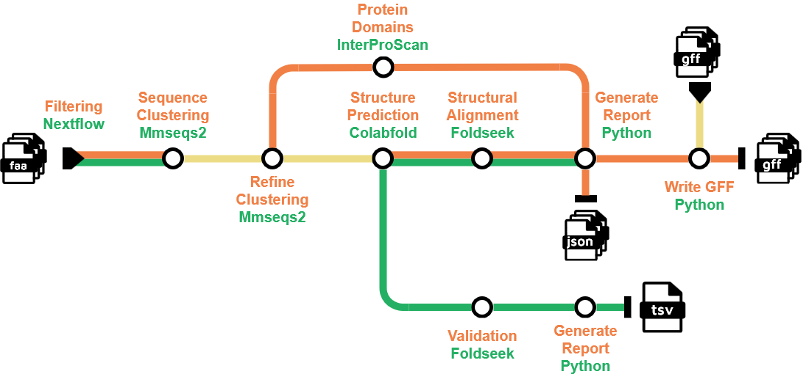

# A nextflow pipeline to uncover and compare unknown gene functions in bacteriophage genomes

## Introduction

This pipeline tries to find putative protein functions for unknown phage proteins using a combination of sequence- and structure-based inference methods.

MMseqs2 clustering and InterProScan are used for sequence-based inference.
ColabFold and Foldseek are used for structure-based inference.

The pipeline is build using Nextflow and Python. All scripts can found in `bin/`.
The pipeline can be run using the two Docker images provided in `dockerfiles`.

## Pipeline summary

<picture>
  <source media="(prefers-color-scheme: dark)" srcset="pipeline-subway-alt.png">
  <source media="(prefers-color-scheme: light)" srcset="pipeline-subway.png">
  
</picture>

1. Input proteins are filtered based on their annotation. Proteins annotated with **hypothetical, putative** or **postulated** are labelled as **unknown**. The rest as **known**.
2. Proteins are clusters twice using [`MMseqs2`](https://github.com/soedinglab/MMseqs2). First to reduce redundance, and second to group related proteins. The cluster representatives are used for further analysis.
    - **Unknown** proteins that are clustered together with **known** proteins are assigned the function of the **known** protein. 
3. **Unknown** proteins get assigned sequence domains using [`InterProScan`](https://www.ebi.ac.uk/interpro/search/sequence/).
4. **All** sequence representatives are input to [`ColabFold`](https://github.com/sokrypton/ColabFold) for structure prediction.
5. Protein structures from **Unknown** proteins are aligned against a structure database using [`Foldseek`](https://github.com/steineggerlab/foldseek).
6. Optionally use structures of **known** proteins to align against a reference database of known protein structures to verify accuracy of predicted structures.
7. Generate a JSON-report of findings for each input phage. 
8. Re-annotate GFF files with putative functions and domains.

## Usage

The standard command to run the pipeline is as follows:
```bash
nextflow run main.nf \
--foldseekdb=databaseDirectory/db/db_name \
--colabdb=databaseDirectory/colabfolddb \
--email=valid-E-mail-adress
```

To run without the colabfold structure database and with the Foldseek database downloaded like instructed below:
```bash
nextflow run main.nf \
--foldseekdb=databases/af_prot/db \
--wsl \
--email=valid-E-mail-adress
```

For further information run:
```bash
nextflow run main.nf --help
```

## Pipeline output
Results are stored in the `results` directory. Files for each major step are stored in sepereate sub-folders.

## Docker
Docker images can be installed with:
```bash
docker build -t phagomics dockerfiles/docker_phage_image
```
and
```bash
docker build -t colabfold dockerfiles/docker_colabfold
```

## Databases
### Foldseek (Structural alignment)
The Foldseek database (Alphafold/Proteome) can be downloaded via the docker image using the following commands:
```bash
mkdir -p databases/af_prot
```
```bash
docker run --rm \
-v ./databases/af_prot:/data \
phagomics \
foldseek databases Alphafold/Proteome /data/db /data/tmp
```

### Colabfold (structure MSA generation)
For information on how to install the colabfold search database (~2TB!) used for structure prediction, visit: https://colabfold.mmseqs.com/

## Analysis scripts
`bin/analysisScripts/analysis.py`, `bin/analysisScripts/visualizationScripts.py` and `bin/analysisScripts/getPdbs.py` are the main scipts and can be used with default pipeline execution (fingers crossed).

`analysis.py` calculates statistics about the results. Also must be run before `getPdbs.py`.

`getPdbs.py` gets the .pdb files (protein structure files) from the colabfold subfolder, for structures that had a putative function assigned through [`Foldseek`](https://github.com/steineggerlab/foldseek). These can then be clustered using Foldseek to identify similar predicted structures.

For more details and an example workflow see `bin/analysisScripts/analysis_workflow.md`

`visualizationScripts.py` creates three figures: 
1. Barplot showing the ratio of **known** to **unknown** proteins per phage.
2. Barplot showing the cluster sizes and makeup.
3. Scatterplot showing cluster heterogeneity.
